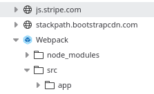

# SourceMapper
This is a Burpsuite extension for injecting offline source maps for easier JavaScript debugging.

It has become common place for JavaScript and CSS files to be "minified" in order to reduce the amount of data transfer required when a user visits a web application.  This is particulalrly likely when the web application is a Single Page Application (SPA) or other heavy user of client-side code.  Unfortunately, minification makes the code very difficult to debug.  The process of minification removes all functionally-unnecessary whitespace and reduces variable and function names to as short a value as possible, often down to a single character.  For example the following minified (but pretty-printed) code snippet:

When a source map has been applied you get extra visibility in the form of extra resources appearing in the file-tree within the browser's developer console:

And these resources can be read and understood like the original code.

## Why is this extension needed and what does it do?
Depending on the security stance of the system, it is commonly thought that publicly including source maps is a vulnerability in its own right.  Rightly, or wrongly, this means source maps are not usually available publicly, but, as a consultant the customer is likely willing to give you a copy of those source maps if you ask.  To use the source maps you can do offline decompilation, but, this then disconnects the browser's consumption of the minified JavaScript with the decompiled and human-readable code.  Ideally, this means you want the source maps to also be consumed by the browser and then you get the smoothest experience.  

This extension adds the necessary content for the browser to know that a source map is available and then it injects that source map in such a way that the browser doesn't need to check for CORS violations.  Browsers don't behave exactly the same with source maps as they do for all other resources, but, they do tend to apply things like CORS policies.  (For example, you won't see the browsers request for a ".map" file within the network sub-section of the developer tools.)

## Usage
Once the extension has been installed, navigate to the new tab and double check the settings.  Not many options to choose from and the main thing to note is that the location that the extension will look for ".map" files.  Change this setting, or make the directory, and make sure that all your map files are located here.  No need for sub-directories and so on, just make sure the map files have exactly the same name as the original JS file but additionally have the ".map" extension.  

For example: `main-320943204324.min.js` should become: `main-320943204324.min.js.map`

Once this is done, visit your target web application, open the developer tools and visit the "Sources" (Chrome) or "Debugger" tabs to trigger the browser to fetch the source map files.  Once this is done, you should be able to see the extra resources in the file tree.

Debug output is currently sent to the SourceMapper pane within the extensions tab under "Output".

## Known issues
* Source maps can be applied to JavaScript and CSS files.  This extension currently only deals with JavaScript files.
* Weird character sets in the map files can cause weird effects.  For this reason the extension attempts to "flatten" weird chars back into standard ASCII so that they can be converted into the relevant bytearray / array types for use by Burp.  In practice this shouldn't impact the user, but, occasionally it won't convert weird characters in an expected fashion which can leak to presentational oddities.  There is probably a better way to handle this, but, it works.

## Credits

The extension was written by Felix Ryan of You Gotta Hack That, but as always, Pete was a brave and noble duck.  Thank you for your help!
